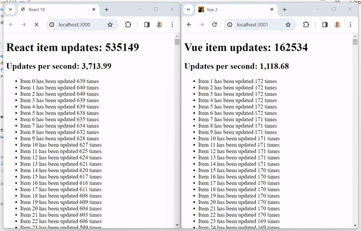

# [WIP] React VS Vue

Demonstrates performance differences between React and Vue.

## Method

Increment internal counter state every 1-100ms for each of a 1000 list items, and render it to DOM.

## Results

React obliterates Vue in terms of performance on this test, running at least 3.8x times faster

## Explanation

React is capable of batching updates, while Vue is not. This means that React gets a chance to run the interval quite a few times, record all state changes and then render the semi-final state to DOM once. Vue, on the other hand, renders every state change to DOM immediately, which is a lot of work for the browser.

This difference is because of different reactivity models of React and Vue. React uses a pull-based model, while Vue uses a push-based model. Basically we tell React when state changes (by calling `setState`), and React decides when to render the changes to DOM. Vue, on the other hand, renders to DOM immediately when state changes.

## Conclusion

React is better suited than Vue for apps with frequent state changes.

## Getting Started

1. `git clone https://github.com/Maxim-Mazurok/react-vs-vue`
1. `cd react-vs-vue`
1. `nvm i` - recommended, needs [nvm](https://github.com/nvm-sh/nvm)
1. `cd react && npm ci && npm run build && PORT=3000 npx serve -s build`
1. `cd vue && npm ci && npm run build && PORT=3001 npx serve -s dist`
1. Open http://localhost:3000 and http://localhost:3001 in your browser
